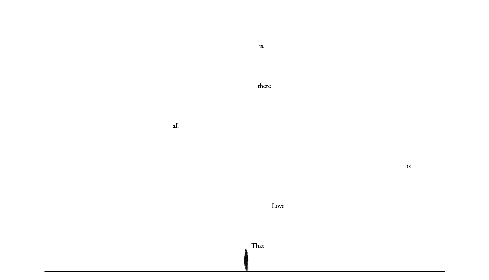

# emblaster

emblaster is a challenging poetry shooter game inspired by Gabrielle Zevin's _Tomorrow, and Tomorrow, and Tomorrow_. It is a live interpretation of _EmilyBlaster_, a game that Sadie develops in the novel.

This game features the poems: _That Love is All There Is_ by Emily Dickinson, _Meditation at Lagunitas_ by Robert Hass, and _Howl_ by Allen Ginsberg.

The frontend is built using vanilla JavaScript, HTML, and CSS. The global leaderboard is stored using MongoDB and the application is deployed with Vercel.

The game is designed to be unbeatable.
